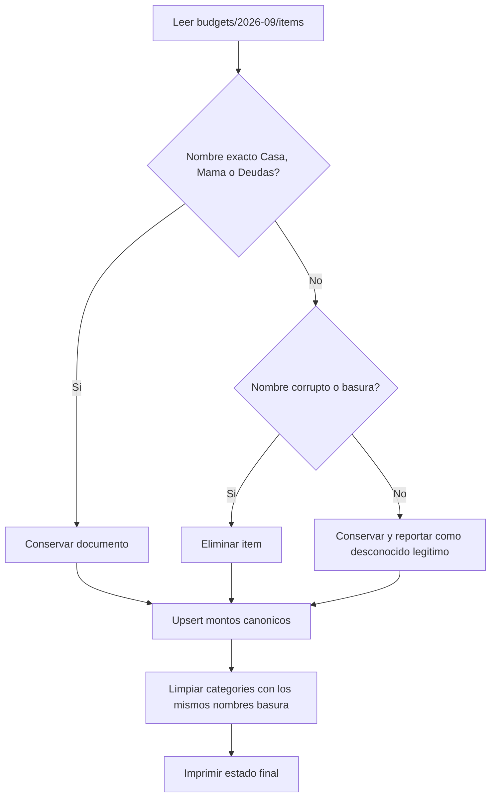

# Plan: Limpieza de presupuestos corruptos — Septiembre 2026

## Objetivo

Depurar Firestore del usuario maestro `1536228767180136498` en `budgets/2026-09/items`, dejando los techos válidos y eliminando documentos creados por parsers viejos.

Estado final esperado:

| Categoría | Monto |
|---|---|
| Casa | $150,000 |
| Mamá | $150,000 |
| Deudas | $205,000 |

Fuera de alcance: parsers, Gemini, cuentas, transacciones, saldos y otros meses.

## Diagnóstico

El script actual [`scripts/cleanup_budgets_sep2026.py`](scripts/cleanup_budgets_sep2026.py) es inseguro:

1. Conserva solo `Mamá` y borra **todo lo demás**, incluida `Casa` y `Deudas`.
2. Recrea `Mamá` y `Deudas`, pero no `Casa`.
3. Decide con `name.strip().lower() in ["mamá", "mama"]`, sin `_cat_exacta`.
4. No reporta un before/after claro ni distingue duplicados.

Documentos basura conocidos:

- `Hola, Yerbis. Yerbis, Puedes Poner`
- `Septiembre.`
- `Son 205.000 No`
- `Mamá Deudas,`
- `Necesito Q Edites...`

Regla crítica: `Mamá Deudas,` **no** es `Mamá`. Hay que usar coincidencia exacta normalizada (`_cat_exacta`), nunca `_coincidir_categoria`.



## Cambios

### 1. Reescribir [`scripts/cleanup_budgets_sep2026.py`](scripts/cleanup_budgets_sep2026.py)

Alcance fijo:

- Usuario: `1536228767180136498`
- Periodo: `2026-09`
- Colecciones: `users/{uid}/budgets/2026-09/items` y, si aplica, `users/{uid}/categories`

Allowlist exacta:

```python
KEEP = {
    "Casa": 150000,
    "Mamá": 150000,
    "Deudas": 205000,
}
```

Un item se conserva si `_cat_exacta(category_name, keep_name)` es verdadero para alguno de esos tres nombres.

Un item se borra si:

- No está en la allowlist **y**
- Coincide con basura conocida, o
- Contiene dígitos, o
- El nombre normalizado es un mes (`septiembre`), o
- El nombre es una frase larga de comando (`hola yerbis`, `necesito q edites`, más de ~40 caracteres)

Si aparece un nombre corto desconocido que parece categoría real (`Gym`, `Moto`), **no borrar**. Reportarlo y dejarlo.

Duplicados de allowlist: conservar uno (el de nombre más limpio) y borrar extras. Luego `establecer_presupuesto_mes` para fijar el monto canónico.

Limpieza de `categories`: borrar solo documentos cuyo `nombre` coincida con los patrones basura y **no** sea exacto a Casa/Mamá/Deudas. No tocar categorías legítimas aunque estén sin presupuesto.

El script debe:

- Insertar `sys.path` al root del repo, como los otros scripts.
- Usar `PYTHONIOENCODING=utf-8` / `sys.stdout.reconfigure(encoding="utf-8")`.
- Imprimir inventario inicial, acciones y estado final.
- No mutar `accounts`, `transactions` ni otros meses.

### 2. Ejecutar contra Firestore local

```bash
PYTHONIOENCODING=utf-8 py -3 scripts/cleanup_budgets_sep2026.py
```

Requiere `serviceAccountKey.json` o `FIREBASE_CREDENTIALS`.

### 3. Verificar

Estado final de `users/1536228767180136498/budgets/2026-09/items/`:

- `Casa`: $150,000
- `Mamá`: $150,000
- `Deudas`: $205,000
- Cero documentos `Hola Yerbis`, `Septiembre.`, `Son 205`, `Mamá Deudas,`

### 4. Documentación

- [`TODO.md`](TODO.md): marcar la limpieza de documentos corruptos como hecha.
- [`plsanes.md`](plsanes.md): el estado esperado incluye `Casa`, no solo Mamá/Deudas.

## No hacer

- No borrar `Casa`, `Mamá` ni `Deudas`.
- No usar coincidencia parcial para decidir qué se conserva.
- No restar presupuestos de `accounts.balance`.
- No tocar parsers ni `SYSTEM_INSTRUCTION` en este sprint.
- No ejecutar `migrar_sep_a_ago.py`.
